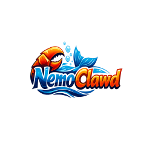
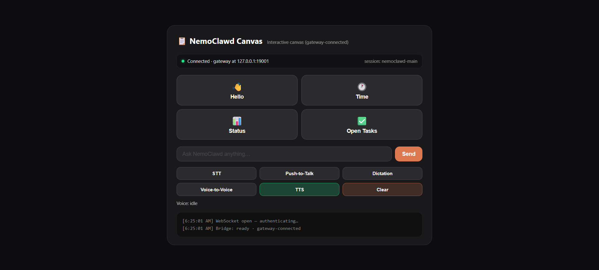

<p align="center">
  
</p>

# NemoClawd

**What if the original ClawdBot and NVIDIA NeMo got together and had a baby?**

You would get NemoClawd: a next-generation AI identity built at the intersection of rugged autonomy, adaptive intelligence, and real-world execution.

NemoClawd is an integrated workspace that combines the `clawdbot` Node.js/TypeScript runtime with the `NeMo-Agent-Toolkit-develop` Python toolkit.

The project uses a bridge-first architecture: Node orchestration calls the Python layer through `NemoBridge`, and Python executes NeMo workflows through the `nat` CLI with structured JSON results returned to Node.

In this repository, NemoClawd also includes canvas host branding updates, outbound transcript mirroring, and system-of-record anchoring so runtime behavior and identity settings stay consistent across builds and launches.

The goal is practical: keep Clawdbot-compatible operations while adding NeMo-backed workflow execution in one buildable source tree so that it can operate in enterprise environments.

NemoClawd currently focuses as a "Digital Project Manager".

<p style="text-align: center;">
  
</p>

## Recent upgrades

- Canvas branding now uses NemoClawd assets in `apps/clawdbot-main/src/canvas-host/a2ui/`:
  - `nemoclawd-favicon.ico`
  - `nemoclawd-apple-touch-icon.png`
  - `nemoclawd-logo.png`
- Canvas A2UI page title is now `NemoClawd Canvas` in `apps/clawdbot-main/src/canvas-host/a2ui/index.html`.
- Canvas host fallback/default page title is now `NemoClawd Canvas` in `apps/clawdbot-main/src/canvas-host/server.ts`.
- Outbound assistant transcript mirroring is wired through `deliverOutboundPayloads` in `apps/clawdbot-main/src/infra/outbound/deliver.ts`.
- Mirrored transcript text normalization (including media filename extraction) is implemented in `apps/clawdbot-main/src/config/sessions/transcript.ts`.

## What is included

- A root `package.json` that orchestrates the TypeScript build, the upstream Clawdbot build, Python environment bootstrap, NeMo source package builds, and artifact collection.
- A root `pyproject.toml` for a lightweight Python bridge package named `nemoclawd-bridge`.
- A TypeScript bridge in `src/nemo-bridge.ts` that lets Node code invoke Python NeMo workflows through a stable subprocess contract.
- A Python bridge in `python_src/nemoclawd_bridge/__main__.py` that exposes `health` and `run` commands.
- A unified Docker image in `Dockerfile` and Compose setup in `docker-compose.yml`.
- Build outputs in root `dist/`, local `apps/clawdbot-main/dist/`, and root `artifacts/`.

## Workspace layout

This project contains both codebases directly under `apps/` as normal directories:

- `apps/clawdbot-main`
- `apps/NeMo-Agent-Toolkit-develop`

NemoClawd builds and runs from this single source tree without requiring sibling repositories.

## Architecture

### Build orchestration

1. Root TypeScript bridge compiles to `dist/`.
2. Root Node build script runs `pnpm build` inside `apps/clawdbot-main`.
3. Root Python bootstrap script prepares `apps/NeMo-Agent-Toolkit-develop/.venv`, installs packaging tools, and installs the published `nvidia-nat` runtime.
4. Root Python build script builds:
   - the local `nemoclawd-bridge` package into `artifacts/python-bridge/`
   - the local NeMo source checkout into `artifacts/python-nemo-source/`
5. Artifact collection indexes Python package outputs in `artifacts/python-nemo-source/` and writes `artifacts/manifest.json`.

### Runtime communication

- Node uses `NemoBridge` from `dist/index.js`.
- `NemoBridge` launches `python -m nemoclawd_bridge ...` inside the NeMo virtual environment.
- The Python bridge performs one of two actions:
  - `health`: reports whether the `nat` CLI is available.
  - `run`: invokes `nat run --config_file ... --input ...` and returns structured JSON to Node.

This subprocess model keeps Python runtime dependencies isolated from the Node runtime while preserving Node-side workflow orchestration.

### Execution guard policy

Each `chat.send` request is evaluated before execution:

- **Job type detection:** classifies the request as `text-based` or `purpose-driven`.
- **Circadian phase detection:** maps local time to `startup` (06-09), `focus` (09-18), `winddown` (18-22), or `sleep` (22-06).
- **Execution policy:**
  - blocks non-purpose text work during sleep hours,
  - allows overnight purpose-driven work only when urgency indicators are present (for example: `urgent`, `critical`, `incident`, `outage`, `hotfix`).

When blocked, the gateway returns a structured `chat.send` error payload with `reason`, `phase`, and detected `job type`.

### System of record

Identity and core runtime defaults are defined in `system-of-record.json`.

- Canonical assistant name: `NemoClawd`
- Canonical session key: `nemoclawd-main`
- Canonical gateway port: `19001`

To keep NemoClawd embedded in the system of record, run:

```powershell
Set-Location "E:\AIEnv_Adam\AIEnv\Storage_of_Programs\NemoClawd\NemoClawd-integrated"
pnpm run sor:verify
```

Verification output is written to `artifacts/system-of-record.status.json`.

## Verified status

The following were verified during setup in this workspace:

- `clawdbot-main`: `pnpm install` and `pnpm build`
- `NeMo-Agent-Toolkit-develop`: local `.venv` bootstrap, `nat --help`, and `python -m build --wheel --sdist`

The NeMo source build required a fallback SCM version because this checkout does not currently expose git metadata to `setuptools-scm`. The build scripts handle that by setting:

- `SETUPTOOLS_SCM_PRETEND_VERSION=0.0.0`
- `SETUPTOOLS_SCM_PRETEND_VERSION_FOR_NVIDIA_NAT=0.0.0`

## Setup

### Prerequisites

- Node.js 22.12+
- pnpm 10+
- Python 3.11-3.13
- Optional: `uv`
- Optional: Docker Desktop

### Install root dependencies

```powershell
Set-Location "E:\AIEnv_Adam\AIEnv\Storage_of_Programs\NemoClawd\NemoClawd-integrated"
pnpm install
```

### Build everything

```powershell
Set-Location "E:\AIEnv_Adam\AIEnv\Storage_of_Programs\NemoClawd\NemoClawd-integrated"
pnpm run build:all
```

## Smoke test the bridge

```powershell
Set-Location "E:\AIEnv_Adam\AIEnv\Storage_of_Programs\NemoClawd\NemoClawd-integrated"
pnpm run smoke:test
```

This checks the Node -> Python bridge path by asking the Python helper to report whether the `nat` CLI is available.

## Use the bridge from Node.js

Example usage after `pnpm run build`:

```javascript
import { NemoBridge } from "./dist/index.js";

const bridge = new NemoBridge();
const health = await bridge.health();
console.log(health.payload);
```

To run a workflow from Node:

```javascript
import { NemoBridge } from "./dist/index.js";

const bridge = new NemoBridge();
const result = await bridge.runWorkflow({
  configFile: "workflows/nemo-sample.workflow.yml",
  input: "List five subspecies of aardvarks",
});

console.log(result.payload.stdout);
console.error(result.payload.stderr);
```

The sample workflow in `workflows/nemo-sample.workflow.yml` follows the upstream NeMo hello-world example and requires `NVIDIA_API_KEY`.

## Start Clawdbot with NeMo environment variables prepared

```powershell
Set-Location "E:\AIEnv_Adam\AIEnv\Storage_of_Programs\NemoClawd\NemoClawd-integrated"
pnpm run start:clawdbot -- --help
```

This launches the built Clawdbot entrypoint and injects default `NEMOCLAWD_*` environment variables pointing at the NeMo virtual environment.

## Docker

The integrated container includes both Node and Python runtimes.

### Build the container

```powershell
Set-Location "E:\AIEnv_Adam\AIEnv\Storage_of_Programs\NemoClawd\NemoClawd-integrated"
docker compose build
```

### Start the integrated runtime

```powershell
Set-Location "E:\AIEnv_Adam\AIEnv\Storage_of_Programs\NemoClawd\NemoClawd-integrated"
docker compose up nemoclawd
```

## Artifacts

After `pnpm run build:all`, expected outputs are:

- `dist/` - compiled TypeScript bridge
- `apps/clawdbot-main/dist/` - compiled Clawdbot output
- `artifacts/python-bridge/` - `nemoclawd-bridge` wheel and sdist builds
- `artifacts/python-nemo-source/` - NeMo source wheel and sdist builds
- `artifacts/manifest.json` - artifact summary

## Notes

- The integration layer keeps upstream source trees local in `apps/` and adds bridge/orchestration code in the root project.
- The bridge uses subprocess JSON exchange instead of embedding Python directly into Node, which keeps failure modes easier to debug.
- If the NeMo checkout later includes full git metadata, the fallback SCM version environment variables can be removed.

## Repository owner

- Owner: Darrell Mesa
- Contact: darrell.mesa@pm-ss.org