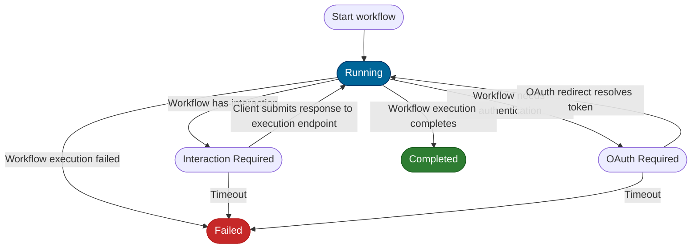

<!--
SPDX-FileCopyrightText: Copyright (c) 2025-2026, NVIDIA CORPORATION & AFFILIATES. All rights reserved.
SPDX-License-Identifier: Apache-2.0

Licensed under the Apache License, Version 2.0 (the "License");
you may not use this file except in compliance with the License.
You may obtain a copy of the License at

http://www.apache.org/licenses/LICENSE-2.0

Unless required by applicable law or agreed to in writing, software
distributed under the License is distributed on an "AS IS" BASIS,
WITHOUT WARRANTIES OR CONDITIONS OF ANY KIND, either express or implied.
See the License for the specific language governing permissions and
limitations under the License.
-->

# HTTP Interactive Execution

NeMo Agent Toolkit supports interactive workflows (Human-in-the-Loop and OAuth) over plain HTTP,
without requiring a WebSocket connection. This is useful in deployment environments where WebSocket
support is limited.

When enabled, the interactive extensions allow HTTP clients to:

- Start a workflow execution and receive an execution ID
- Poll for execution status (running, interaction required, OAuth required, completed, or failed)
- Submit interaction responses (text, binary choice, radio, checkbox, dropdown, or notification acknowledgment)
- Handle OAuth2 authorization code flows through status polling

Two client integration patterns are supported:

- **Polling mode**: The server returns `202 Accepted` with an execution ID. The client polls
  `GET /executions/{execution_id}` until the workflow completes or requires interaction.
- **Streaming mode (SSE)**: The server streams workflow output as Server-Sent Events. When an
  interaction or OAuth flow is needed, a typed SSE event is emitted. The client submits its
  response, and the stream resumes.

## Configuration

HTTP interactive extensions are enabled by default on all workflow endpoints **except for**
OpenAI-compatible endpoints (`/v1/chat/completions`). To force the interactive extension to work
with OpenAI-compatible endpoints, set `enable_interactive_extensions` to `true` in the FastAPI
front-end configuration:

```yaml
general:
  front_end:
    _type: fastapi
    enable_interactive_extensions: true
```

The following table describes the relevant configuration parameters:

| Parameter | Type | Default | Description |
|-----------|------|---------|-------------|
| `enable_interactive_extensions` | boolean | `false` | Enable HTTP interactive execution on OpenAI-compatible endpoints. When `true`, POST requests to chat and OpenAI-compatible endpoints (`/v1/chat/completions`) return `202 Accepted` if the workflow pauses for interaction or OAuth |
| `disable_legacy_routes` | boolean | `false` | Disable legacy endpoint paths (`/generate`, `/chat`). When `true`, only versioned paths with interactive support (`/v1/workflow`, `/v1/chat`) are registered |
| `oauth2_callback_path` | string | `/auth/redirect` | Path for the OAuth2 authorization code grant callback endpoint |

:::{note}
Interactive extensions are enabled for versioned **workflow** and **chat** endpoints (for example,
`/v1/workflow` and `/v1/chat`).

OpenAI-compatible endpoints (`/v1/chat/completions`) are opt-in only (defaulting to disabled).
:::

## Execution Lifecycle

An interactive HTTP execution moves through the following states:



## Endpoints

### Starting an Execution (Polling Mode)

POST requests to versioned endpoints such as `/v1/chat` return a `202 Accepted` response if the
workflow requires interaction or OAuth before it can complete. Interactive support is enabled by
default on these endpoints; the `enable_interactive_extensions` flag only gates OpenAI-compatible
endpoints (see [Configuration](#configuration)).

**Request:**

```bash
curl -X POST http://localhost:8000/v1/chat \
  -H "Content-Type: application/json" \
  -d '{
    "messages": [
      {"role": "user", "content": "Analyze the sales data"}
    ]
  }'
```

**Response (202 Accepted, interaction required):**

```json
{
  "status": "interaction_required",
  "status_url": "/executions/550e8400-e29b-41d4-a716-446655440000",
  "interaction_id": "a1b2c3d4-e5f6-7890-abcd-ef1234567890",
  "prompt": {
    "input_type": "text",
    "text": "Should I include Q4 projections?",
    "placeholder": "Type your response...",
    "required": true,
    "timeout": null,
    "error": null
  },
  "response_url": "/executions/550e8400-e29b-41d4-a716-446655440000/interactions/a1b2c3d4-e5f6-7890-abcd-ef1234567890/response"
}
```

The `error` field inside the `prompt` object is only populated when the prompt times out or becomes
unavailable. Under normal operation it is `null`.

**Response (202 Accepted, OAuth required):**

```json
{
  "status": "oauth_required",
  "status_url": "/executions/550e8400-e29b-41d4-a716-446655440000",
  "auth_url": "https://provider.example.com/authorize?client_id=...&state=abc123",
  "oauth_state": "abc123"
}
```

If the workflow completes without requiring interaction, a standard `200 OK` response with the
workflow result is returned, identical to the non-interactive behavior.

### Getting Execution Status

Poll the execution status endpoint to check progress or retrieve the final result.

- **Route:** `GET /executions/{execution_id}`
- **Description:** Returns the current status of an execution.

**Request:**

```bash
curl http://localhost:8000/executions/550e8400-e29b-41d4-a716-446655440000
```

**Response (running):**

```json
{
  "status": "running"
}
```

**Response (interaction required):**

```json
{
  "status": "interaction_required",
  "interaction_id": "a1b2c3d4-e5f6-7890-abcd-ef1234567890",
  "prompt": {
    "input_type": "text",
    "text": "Should I include Q4 projections?",
    "placeholder": "Type your response...",
    "required": true,
    "timeout": null,
    "error": null
  },
  "response_url": "/executions/550e8400-e29b-41d4-a716-446655440000/interactions/a1b2c3d4-e5f6-7890-abcd-ef1234567890/response"
}
```

The `error` field inside the `prompt` object is only populated when the prompt times out or becomes
unavailable. Under normal operation it is `null`.

**Response (OAuth required):**

```json
{
  "status": "oauth_required",
  "auth_url": "https://provider.example.com/authorize?client_id=...&state=abc123",
  "oauth_state": "abc123"
}
```

**Response (completed):**

```json
{
  "status": "completed",
  "result": {
    "id": "chatcmpl-abc123",
    "object": "chat.completion",
    "choices": [
      {
        "message": {
          "content": "The analysis is complete. Q4 projections have been included.",
          "role": "assistant"
        },
        "finish_reason": "stop",
        "index": 0
      }
    ]
  }
}
```

**Response (failed):**

```json
{
  "status": "failed",
  "error": "Workflow execution timed out after 300 seconds"
}
```

The following table lists all possible status values:

| Status | Description |
|--------|-------------|
| `running` | The workflow is actively executing |
| `interaction_required` | The workflow is paused waiting for a human response |
| `oauth_required` | The workflow is paused waiting for OAuth2 authorization |
| `completed` | The workflow finished successfully; the `result` field contains the output |
| `failed` | The workflow failed; the `error` field contains the error message |

### Submitting an Interaction Response

When an execution has status `interaction_required`, submit a response to resume the workflow.

- **Route:** `POST /executions/{execution_id}/interactions/{interaction_id}/response`
- **Description:** Submit a human response to a pending interaction prompt.

**Request (text response):**

```bash
curl -X POST http://localhost:8000/executions/550e8400-e29b-41d4-a716-446655440000/interactions/a1b2c3d4-e5f6-7890-abcd-ef1234567890/response \
  -H "Content-Type: application/json" \
  -d '{
    "response": {
      "input_type": "text",
      "text": "Yes, include Q4 projections"
    }
  }'
```

**Response:** `204 No Content`

After submitting a response, the execution transitions back to `running`. Continue polling
`GET /executions/{execution_id}` to track progress.

#### Supported Response Types

The `response` field in the request body is a discriminated union based on `input_type`. All
prompt types supported by [Interactive Workflows](../../build-workflows/advanced/interactive-workflows.md)
are available:

| `input_type` | Fields | Description |
|--------------|--------|-------------|
| `text` | `text` (string) | Free-text response |
| `binary_choice` | `selected_option` (object) | One of two options (for example, Continue or Cancel) |
| `radio` | `selected_option` (object) | Single selection from multiple options |
| `checkbox` | `selected_options` (array of objects) | Multiple selections from a list |
| `dropdown` | `selected_option` (object) | Single selection from a dropdown |
| `notification` | (none) | Acknowledgment of a notification prompt |

**Request (radio response):**

```bash
curl -X POST http://localhost:8000/executions/550e8400-e29b-41d4-a716-446655440000/interactions/a1b2c3d4-e5f6-7890-abcd-ef1234567890/response \
  -H "Content-Type: application/json" \
  -d '{
    "response": {
      "input_type": "radio",
      "selected_option": {"id": "email", "label": "Email", "value": "email"}
    }
  }'
```

**Request (checkbox response):**

```bash
curl -X POST http://localhost:8000/executions/550e8400-e29b-41d4-a716-446655440000/interactions/a1b2c3d4-e5f6-7890-abcd-ef1234567890/response \
  -H "Content-Type: application/json" \
  -d '{
    "response": {
      "input_type": "checkbox",
      "selected_options": [
        {"id": "email", "label": "Email", "value": "email"},
        {"id": "sms", "label": "SMS", "value": "sms"}
      ]
    }
  }'
```

#### Success Responses

| Status Code | Condition |
|-------------|-----------|
| `204` | Response accepted successfully |

#### Error Responses

| Status Code | Condition |
|-------------|-----------|
| `400` | Interaction has already been resolved |
| `404` | Execution or interaction not found |

## Streaming Mode with SSE Events

When using streaming endpoints (`/v1/chat/stream` or `/v1/chat/completions` with `stream: true`),
interactive events are delivered as typed Server-Sent Events within the stream.

### Interaction Required Event

When the workflow pauses for human interaction, the following SSE event is emitted:

```text
event: interaction_required
data: {"event_type": "interaction_required", "execution_id": "550e8400-...", "interaction_id": "a1b2c3d4-...", "prompt": {"input_type": "text", "text": "Should I proceed?", ...}, "response_url": "/executions/550e8400-.../interactions/a1b2c3d4-.../response"}
```

After receiving this event, submit the interaction response through the
`POST /executions/{execution_id}/interactions/{interaction_id}/response` endpoint.
The SSE stream remains open and resumes sending workflow output once the response is submitted.

### OAuth Required Event

When the workflow requires OAuth2 authorization, the following SSE event is emitted:

```text
event: oauth_required
data: {"event_type": "oauth_required", "execution_id": "550e8400-...", "auth_url": "https://provider.example.com/authorize?...", "oauth_state": "abc123"}
```

Direct the user to the `auth_url` to complete authorization. After the OAuth redirect callback
is processed, the stream resumes automatically.

### Client Integration Example

The following Python example demonstrates how to consume the SSE stream and handle interactive events:

```python
import httpx
import json


def stream_with_interactions(base_url: str, messages: list[dict]) -> str:
    """Stream a chat request and handle any interactive events."""
    with httpx.Client(base_url=base_url, timeout=300) as client:
        with client.stream(
            "POST",
            "/v1/chat/stream",
            json={"messages": messages},
        ) as response:
            lines_iter = response.iter_lines()
            for line in lines_iter:
                if not line:
                    continue

                # Check for typed SSE events
                if line.startswith("event: interaction_required"):
                    # Next line is the data payload
                    data_line = next(lines_iter)
                    event = json.loads(data_line.removeprefix("data: "))

                    # Prompt the user
                    print(f"Workflow asks: {event['prompt']['text']}")
                    user_input = input("> ")

                    # Submit the response
                    client.post(
                        event["response_url"],
                        json={
                            "response": {
                                "input_type": "text",
                                "text": user_input,
                            }
                        },
                    )
                    continue

                if line.startswith("event: oauth_required"):
                    data_line = next(lines_iter)
                    event = json.loads(data_line.removeprefix("data: "))
                    print(f"Please authorize at: {event['auth_url']}")
                    input("Press Enter after completing authorization...")
                    continue

                # Regular data chunk
                if line.startswith("data: "):
                    chunk = json.loads(line.removeprefix("data: "))
                    if "value" in chunk:
                        return chunk["value"]

    return ""
```

## OpenAI Chat Completions API Compatibility

The OpenAI-compatible endpoint (`/v1/chat/completions`) also supports interactive extensions when
`enable_interactive_extensions` is `true`. The behavior is the same as for the chat endpoints:

- **Non-streaming** (`stream: false`): Returns `202 Accepted` with execution details when
  interaction or OAuth is required
- **Streaming** (`stream: true`): Emits `interaction_required` or `oauth_required` SSE events
  within the stream

```bash
curl -X POST http://localhost:8000/v1/chat/completions \
  -H "Content-Type: application/json" \
  -d '{
    "model": "nvidia/llama-3.1-8b-instruct",
    "messages": [
      {"role": "user", "content": "Summarize my documents"}
    ],
    "stream": false
  }'
```

If the workflow needs human input, the response is `202 Accepted` with the same structure as the
[polling mode responses](#starting-an-execution-polling-mode) described above.

## OAuth2 Flow over HTTP

When a workflow requires OAuth2 authentication (for example, to access a third-party API), the
execution pauses and the authorization URL is surfaced through the execution status or SSE event.

The flow works as follows:

1. The workflow calls an authenticated tool that requires OAuth2
2. The execution status changes to `oauth_required` with the `auth_url`
3. The client directs the user to the `auth_url` to complete authorization
4. The OAuth provider redirects the user to the configured callback path (default: `/auth/redirect`)
5. The callback endpoint exchanges the authorization code for a token and resolves the execution
6. The execution transitions back to `running` and the workflow continues

:::{note}
The OAuth2 callback endpoint must be reachable by the user's browser. Ensure `oauth2_callback_path`
is configured correctly for your deployment environment.
:::

## Related Documentation

- [Interactive Workflows Guide](../../build-workflows/advanced/interactive-workflows.md) for
  building workflows with human-in-the-loop interactions
- [API Server Endpoints](./api-server-endpoints.md) for the full list of HTTP and WebSocket endpoints
- [WebSocket Message Schema](./websockets.md) for the WebSocket-based interactive messaging format
