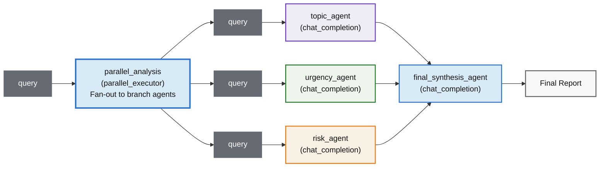

<!--
SPDX-FileCopyrightText: Copyright (c) 2025-2026, NVIDIA CORPORATION & AFFILIATES. All rights reserved.
SPDX-License-Identifier: Apache-2.0

Licensed under the Apache License, Version 2.0 (the "License");
you may not use this file except in compliance with the License.
You may obtain a copy of the License at

http://www.apache.org/licenses/LICENSE-2.0

Unless required by applicable law or agreed to in writing, software
distributed under the License is distributed on an "AS IS" BASIS,
WITHOUT WARRANTIES OR CONDITIONS OF ANY KIND, either express or implied.
See the License for the specific language governing permissions and
limitations under the License.
-->

# Parallel Executor

**Complexity:** 🟢 Beginner

This example demonstrates how to compose a built-in parallel fan-out and fan-in stage inside a sequential workflow in the NVIDIA NeMo Agent Toolkit. The workflow runs three LLM analysis branches in parallel (`topic_agent`, `urgency_agent`, and `risk_agent`) and then synthesizes the appended branch outputs into a final recommendation.

The NeMo Agent Toolkit provides built-in [`parallel_executor`](../../../packages/nvidia_nat_langchain/src/nat/plugins/langchain/control_flow/parallel_executor.py) and [`sequential_executor`](../../../packages/nvidia_nat_langchain/src/nat/plugins/langchain/control_flow/sequential_executor.py) tools. This example uses `parallel_executor` as one stage in a sequential chain.

## Table of Contents

- [Key Features](#key-features)
- [Graph Structure](#graph-structure)
- [Configuration](#configuration)
  - [Required Configuration Options](#required-configuration-options)
  - [Optional Configuration Options](#optional-configuration-options)
  - [Example Configuration](#example-configuration)
- [Installation and Setup](#installation-and-setup)
  - [Install this Workflow](#install-this-workflow)
  - [Set Up API Keys](#set-up-api-keys)
- [Run the Workflow](#run-the-workflow)
  - [Expected Output](#expected-output)

## Key Features

- **Sequential + Parallel orchestration**: Runs independent branch analyses concurrently and resumes linear execution with appended branch outputs.
- **LLM-powered branch analysis**: Uses `chat_completion` tools for topic, urgency, and risk analysis.
- **Built-in control flow**: Uses core `parallel_executor` and `sequential_executor` components without custom orchestration code.

## Graph Structure

The workflow combines sequential and parallel execution:



This structure shows how the sequential executor can call a parallel stage and then continue to a synthesis stage.

## Configuration

Configure this workflow through the `config.yml` file.

This example uses the same LLM setup as the hybrid control flow example:

- `model_name: nvidia/nemotron-3-nano-30b-a3b`
- `temperature: 0.0`
- `max_tokens: 4096`

### Required Configuration Options

- **`parallel_analysis._type`**: Set to `parallel_executor` for fan-out and fan-in execution.
- **`parallel_analysis.tool_list`**: Branch functions to run concurrently.
- **`chat_completion.llm_name`**: LLM used by each branch and final synthesis stage.
- **`workflow._type`**: Set to `sequential_executor` to execute stages in order.
- **`workflow.tool_list`**: Ordered stage list containing the parallel stage and synthesis stage.

### Optional Configuration Options

- **`parallel_analysis.description`**: Description of the parallel stage.
- **`parallel_analysis.detailed_logs`**: Enable informational logs for fan-out, per-branch execution, and fan-in summary.
- **`parallel_analysis.return_error_on_exception`**: If `true`, append branch error text in the fan-in output instead of raising.
- **`workflow.raise_type_incompatibility`**: Whether sequential executor raises on type mismatch (default in this example: `false`).

### Example Configuration

```yaml
llms:
  nim_llm:
    _type: nim
    model_name: nvidia/nemotron-3-nano-30b-a3b
    temperature: 0.0
    max_tokens: 4096

functions:
  topic_agent:
    _type: chat_completion
    llm_name: nim_llm
  urgency_agent:
    _type: chat_completion
    llm_name: nim_llm
  risk_agent:
    _type: chat_completion
    llm_name: nim_llm

  parallel_analysis:
    _type: parallel_executor
    tool_list: [topic_agent, urgency_agent, risk_agent]
    detailed_logs: true
    return_error_on_exception: false

  final_synthesis_agent:
    _type: chat_completion
    llm_name: nim_llm

workflow:
  _type: sequential_executor
  tool_list: [parallel_analysis, final_synthesis_agent]
  raise_type_incompatibility: false
```

## Installation and Setup

Before running this example, follow the instructions in the [Install Guide](../../../docs/source/get-started/installation.md#install-from-source) to create the development environment and install the NeMo Agent Toolkit.

### Install this Workflow

From the root directory of the NeMo Agent Toolkit repository, run the following command:

```bash
uv pip install -e examples/control_flow/parallel_executor
```

### Set Up API Keys
If you have not already done so, follow the [Obtaining API Keys](../../../docs/source/get-started/quick-start.md#obtaining-api-keys) instructions to obtain an NVIDIA API key. You need to set your NVIDIA API key as an environment variable to access NVIDIA AI services:

```bash
export NVIDIA_API_KEY=<YOUR_API_KEY>
```

## Run the Workflow

Run the following command from the root of the NeMo Agent Toolkit repository:

```bash
nat run --config_file=examples/control_flow/parallel_executor/configs/config.yml --input "Prepare a launch update for the new mobile feature next week."
```

Additional example command:

```bash
nat run --config_file=examples/control_flow/parallel_executor/configs/config.yml --input "We have an urgent production incident and need an immediate response plan."
```

### Expected Output

```console
--------------------------------------------------
Workflow Result:
=== PARALLEL ANALYSIS REPORT ===
Topic: product
Urgency: medium
Risk: low
Action: Continue with standard planning cadence.
==============================
--------------------------------------------------
```

The exact values vary by input, but the output format remains consistent.
