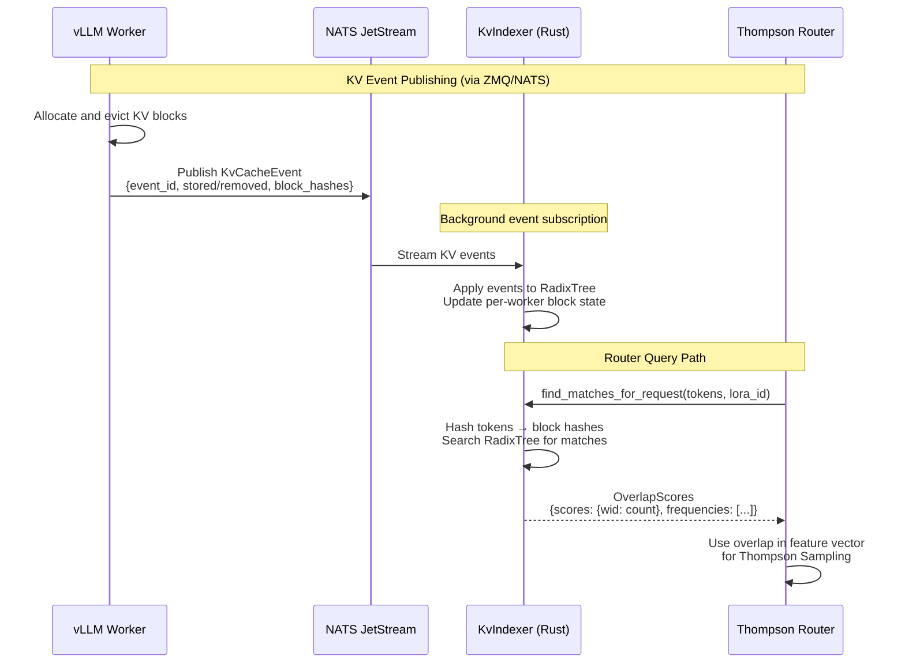
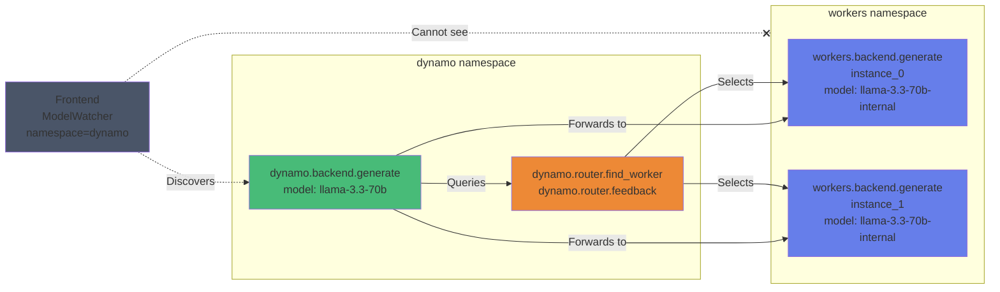
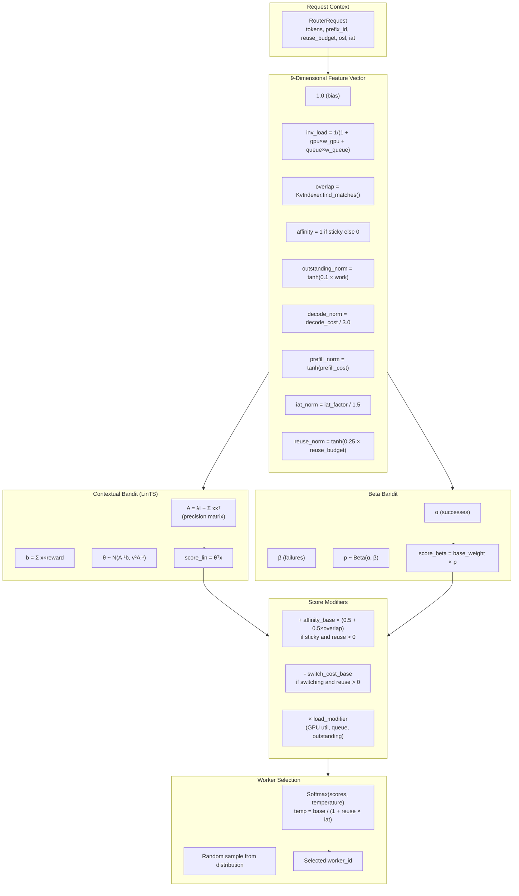

<!--
SPDX-FileCopyrightText: Copyright (c) 2025-2026, NVIDIA CORPORATION & AFFILIATES. All rights reserved.
SPDX-License-Identifier: Apache-2.0

Licensed under the Apache License, Version 2.0 (the "License");
you may not use this file except in compliance with the License.
You may obtain a copy of the License at

http://www.apache.org/licenses/LICENSE-2.0

Unless required by applicable law or agreed to in writing, software
distributed under the License is distributed on an "AS IS" BASIS,
WITHOUT WARRANTIES OR CONDITIONS OF ANY KIND, either express or implied.
See the License for the specific language governing permissions and
limitations under the License.
-->

# End-to-End Sequence Diagram: NeMo Agent Toolkit → Dynamo Integration

This document captures the information flow from NeMo Agent Toolkit chat requests through `dynamo_llm.py` to the custom components launched by `start_dynamo_optimized_thompson_hints_vllm.sh`.

## Architecture Overview

```text
┌─────────────────────────────────────────────────────────────────────────────┐
│                           NeMo Agent Toolkit                                │
│  ┌─────────────────────────────────────────────────────────────────────┐    │
│  │ DynamoModelConfig (dynamo_llm.py)                                   │    │
│  │   prefix_template: "nat-dynamo-{uuid}"                              │    │
│  │   prefix_total_requests: 10                                         │    │
│  │   prefix_osl: 512 (raw int, default)                                │    │
│  │   prefix_iat: 250 (raw int, default)                                │    │
│  │   prefix_use_raw_values: true                                       │    │
│  │   disable_headers: true (headers off by default)                    │    │
│  │   cache_pin_type: ephemeral                                         │    │
│  │   max_sensitivity: 1000                                             │    │
│  │   # reuse_budget: (computed by processor: total_requests - count)   │    │
│  │                                                                     │    │
│  │ _DynamoTransport injects:                                           │    │
│  │   → HTTP Headers: x-prefix-* (disabled by default)                  │    │
│  │   → nvext.annotations in request body                               │    │
│  │   → nvext.agent_hints in request body                               │    │
│  │   → nvext.cache_control in request body                             │    │
│  └─────────────────────────────────────────────────────────────────────┘    │
└─────────────────────────────────────────────────────────────────────────────┘
                                    │
                                    ▼
┌─────────────────────────────────────────────────────────────────────────────┐
│                     Dynamo Stack (Docker Container)                         │
│  ┌─────────────────────────────────────────────────────────────────────┐    │
│  │ Default Frontend (port 8000)                                        │    │
│  │   → Tokenization + nvext parsing                                    │    │
│  │   → ETCD ModelWatcher (namespace=dynamo)                            │    │
│  │   → Discovers processor ONLY (workers hidden)                       │    │
│  └─────────────────────────────────────────────────────────────────────┘    │
│                                    │                                        │
│                                    ▼                                        │
│  ┌─────────────────────────────────────────────────────────────────────┐    │
│  │ Custom Processor (processor.py / processor_multilru.py)             │    │
│  │   → Registered at: dynamo.backend.generate                          │    │
│  │   → Extracts: prefix_id, total_requests, osl, iat                   │    │
│  │   → Manages reuse_budget tracking                                   │    │
│  │   → Queries Router, forwards to Workers                             │    │
│  └─────────────────────────────────────────────────────────────────────┘    │
│                          │                  │                               │
│                          ▼                  ▼                               │
│  ┌────────────────────────────┐  ┌─────────────────────────────────────┐    │
│  │ Custom Router (router.py)   │  │ vLLM Workers (dynamo.vllm)         │    │
│  │   → Thompson Sampling       │  │   → workers.backend.generate       │    │
│  │   → KV Overlap Scoring      │  │   → MultiLRU (optional)            │    │
│  │   → LinTS + Beta-TS         │  │   → KV Events via ZMQ              │    │
│  └────────────────────────────┘  └─────────────────────────────────────┘    │
└─────────────────────────────────────────────────────────────────────────────┘
```

## Sequence Diagram: Full Request Flow

```mermaid
sequenceDiagram
    autonumber
    
    box rgb(45, 50, 80) NeMo Agent Toolkit
        participant Client as Agent/Client<br/>(LangChain/LlamaIndex)
        participant DynamoLLM as DynamoModelConfig<br/>(dynamo_llm.py)
        participant Transport as _DynamoTransport<br/>(httpx wrapper)
    end
    
    box rgb(50, 70, 50) Infrastructure
        participant ETCD as ETCD<br/>(Service Discovery)
        participant NATS as NATS<br/>(KV Events)
    end
    
    box rgb(70, 50, 50) Dynamo Stack
        participant Frontend as Default Frontend<br/>(dynamo.frontend)
        participant Processor as Custom Processor<br/>(processor.py)
        participant Router as Thompson Router<br/>(router.py)
        participant Worker as vLLM Worker<br/>(dynamo.vllm)
        participant KVBM as MultiLRU Backend<br/>(kvbm.v2)
    end
    
    box rgb(60, 60, 40) Observability
        participant Prometheus as Prometheus<br/>(Metrics)
    end

    %% ==================== INITIALIZATION PHASE ====================
    Note over ETCD,NATS: Infrastructure Startup
    
    Worker->>ETCD: Register at workers.backend.generate<br/>(model: llama-3.3-70b-internal)
    Note over Worker: Workers use internal model name<br/>to hide from frontend discovery
    
    Router->>ETCD: Register at dynamo.router.find_worker<br/>& dynamo.router.feedback
    
    Processor->>ETCD: Register at dynamo.backend.generate<br/>(model: llama-3.3-70b)
    Note over Processor: Processor uses PUBLIC model name<br/>→ Frontend discovers ONLY processor
    
    Frontend->>ETCD: ModelWatcher (namespace=dynamo)<br/>Discovers processor only
    
    Worker->>NATS: Subscribe to KV event streams
    
    %% ==================== REQUEST PHASE ====================
    Note over Client,Prometheus: Request Flow with Prefix Hints
    
    rect rgb(35, 40, 60)
        Note right of Client: User initiates chat request
        Client->>DynamoLLM: chat.completions.create()<br/>with DynamoPrefixContext
        
        DynamoLLM->>DynamoLLM: Get prefix_id from DynamoPrefixContext<br/>"{workflow_run_id}-d{depth}"
        
        DynamoLLM->>Transport: Build request with config:<br/>prefix_total_requests=10<br/>prefix_osl=512<br/>prefix_iat=250<br/>latency_sensitivity from Context
    end
    
    rect rgb(40, 50, 45)
        Note right of Transport: Transport Layer Injection
        Transport->>Transport: Read latency_sensitivity from Context<br/>Compute priority = max_sensitivity - latency_sensitivity
        
        Transport->>Transport: Inject nvext.agent_hints:<br/>{latency_sensitivity: float, osl: 512, priority: int}
        
        Transport->>Transport: Inject nvext.annotations:<br/>["prefix_id:{workflow_run_id}-d0",<br/>"total_requests:10",<br/>"osl:512", "iat:250"]
        
        Transport->>Transport: Inject nvext.cache_control:<br/>{type: "ephemeral", ttl: "3s"}<br/>(TTL = total_requests × iat_raw)
        
        Note right of Transport: HTTP headers disabled by default<br/>(disable_headers: true)
        
        Transport->>Frontend: POST /v1/chat/completions<br/>(nvext.annotations + agent_hints + cache_control)
    end
    
    rect rgb(50, 40, 40)
        Note right of Frontend: Frontend Processing
        Frontend->>Frontend: Parse nvext (annotations,<br/>agent_hints, cache_control) from request body
        
        Frontend->>Frontend: Tokenize messages<br/>→ token_ids: [128000, 9906, ...]
        
        Frontend->>Frontend: Build PreprocessedRequest:<br/>{token_ids, annotations, sampling_options}
        
        Frontend->>ETCD: Query ModelWatcher<br/>(namespace=dynamo)
        ETCD-->>Frontend: Discovered: dynamo.backend.generate<br/>(processor, NOT workers)
        
        Frontend->>Processor: Forward PreprocessedRequest<br/>via dynamo.backend.generate
    end
    
    rect rgb(55, 45, 45)
        Note right of Processor: Processor - Hint Extraction
        Processor->>Processor: Extract from annotations:<br/>prefix_id = "{workflow_run_id}-d0"<br/>total_requests = 10<br/>osl = 512<br/>iat = 250
        
        Processor->>Processor: Update _prefix_state:<br/>reuse_budget = total - processed
        
        Processor->>Processor: Build RouterRequest:<br/>{tokens, prefix_id, reuse_budget, osl, iat}
    end
    
    rect rgb(45, 55, 50)
        Note right of Router: Thompson Sampling Routing
        Processor->>Router: Query find_worker(RouterRequest)
        
        Router->>Router: Get available workers<br/>from engine_client.instance_ids()
        
        Router->>Router: KvIndexer.find_matches_for_request()<br/>→ OverlapScores per worker
        
        loop For each worker
            Router->>Router: Build 9-dim feature vector:<br/>[1.0, inv_load, overlap, affinity,<br/>outstanding_norm, decode_norm,<br/>prefill_norm, iat_norm, reuse_norm]
            
            Router->>Router: LinTS sample: θ ~ N(μ, v²Σ⁻¹)<br/>score = θᵀx
            
            Router->>Router: Beta-TS sample: p ~ Beta(α, β)<br/>Add exploration bonus
            
            Router->>Router: Apply affinity bonus (if sticky)<br/>Apply switching penalty (if switch)
            
            Router->>Router: Compute load modifier<br/>(GPU util, queue depth, outstanding work)
        end
        
        Router->>Router: Softmax selection with temperature<br/>temp = base / (1 + reuse * iat_factor)
        
        Router->>Router: Store pending decision:<br/>{decision_id, wid, x, start_ts, ...}
        
        Router-->>Processor: RouterResponse:<br/>{worker_id, decision_id, prefix_hit_rate}
        
        Router->>Prometheus: thompson_router_decisions_total++<br/>thompson_router_kv_overlap.set()
    end
    
    rect rgb(50, 50, 55)
        Note right of Worker: Worker Execution
        Processor->>Processor: thompson_routing_decisions_total++<br/>(worker_id label)
        
        Processor->>Worker: Forward PreprocessedRequest<br/>via workers.backend.generate<br/>(direct routing to worker_id)
        
        alt MultiLRU Enabled (DYNAMO_USE_MULTILRU=true)
            Worker->>KVBM: DynamoScheduler.schedule()
            
            Note over KVBM: MultiLRU 4-Pool Architecture:<br/>Cold (freq < 2) → Warm (2-5)<br/>→ Hot (6-14) → VeryHot (≥15)
            
            KVBM->>KVBM: FrequencyTracker.touch(hash)<br/>Calculate priority level
            
            KVBM->>KVBM: find_matches() across pools<br/>Evict from coldest first
            
            KVBM-->>Worker: Scheduled sequences<br/>with KV cache allocation
        else Standard vLLM Scheduler
            Worker->>Worker: Standard LRU scheduling
        end
        
        Worker->>Worker: Execute prefill + decode<br/>with prefix caching
        
        Worker->>NATS: Publish KV events<br/>(cache state changes)
        
        loop Stream tokens
            Worker-->>Processor: Token chunks<br/>{token_ids, finish_reason, usage}
            
            Processor->>Processor: Extract KVEfficiencyData:<br/>cached_tokens, device_blocks, etc.
            
            Processor-->>Frontend: Forward token chunks
            Frontend-->>Transport: SSE stream
            Transport-->>Client: Streaming response
        end
    end
    
    rect rgb(45, 50, 55)
        Note right of Processor: Feedback Loop
        Processor->>Processor: Calculate latency_ms<br/>tokens_in, tokens_out
        
        Processor->>Router: FeedbackRequest:<br/>{decision_id, latency_ms, success,<br/>tokens_in, tokens_out, finish_reason}
        
        Router->>Router: Retrieve pending decision<br/>by decision_id
        
        Router->>Router: Compute reward:<br/>metric = latency_ms / tokens_out<br/>baseline = EMA(worker, osl, prefill)<br/>reward = 1 / (1 + metric/baseline)
        
        Router->>Router: Update Beta bandit:<br/>α' = α + reward<br/>β' = β + (1 - reward)
        
        Router->>Router: Update LinTS:<br/>A = forget·A + xxᵀ + ridge·I<br/>b = forget·b + x·reward
        
        Router->>Prometheus: thompson_router_feedback_latency<br/>thompson_router_reward.set()
        
        Router-->>Processor: FeedbackAck:<br/>{ok, reward, baseline_used}
    end
    
    rect rgb(40, 45, 50)
        Note right of Prometheus: Metrics Collection
        Processor->>Prometheus: thompson_kve_prompt_tokens_total<br/>thompson_kve_cached_tokens_total<br/>thompson_kve_device_blocks_total
        
        Processor->>Prometheus: thompson_request_latency_seconds<br/>thompson_tokens_in/out_total
        
        Worker->>Prometheus: vllm:gpu_cache_usage_perc<br/>vllm:num_requests_waiting
    end
```



## Detailed Data Structures

### 1. NeMo Agent Toolkit → Frontend

**HTTP Request with `nvext` (`annotations`, `agent_hints`, `cache_control`):**
```json
{
  "model": "llama-3.3-70b",
  "messages": [{"role": "user", "content": "Hello!"}],
  "max_tokens": 50,
  "stream": true,
  "nvext": {
    "annotations": [
      "prefix_id:a1b2c3d4e5f6-d0",
      "total_requests:10",
      "osl:512",
      "iat:250"
    ],
    "agent_hints": {
      "latency_sensitivity": 2.0,
      "osl": 512,
      "priority": 998
    },
    "cache_control": {
      "type": "ephemeral",
      "ttl": "3s"
    }
  }
}
```

> **Note:** `priority` is computed as `max_sensitivity - latency_sensitivity` (default max is 1000).
> `cache_control.ttl` is computed as `total_requests × iat_raw` (in ms), formatted as `"<N>s"` or `"<N>m"`.

**HTTP Headers (disabled by default, enable with `disable_headers: false`):**
```http
x-prefix-id: a1b2c3d4e5f6-d0
x-prefix-total-requests: 10
x-prefix-osl: 512
x-prefix-iat: 250
x-prefix-latency-sensitivity: 2
```

### 2. Frontend → Processor (PreprocessedRequest)

```json
{
  "token_ids": [128000, 9906, 0, ...],
  "annotations": [
    "prefix_id:a1b2c3d4e5f6-d0",
    "total_requests:10",
    "osl:512",
    "iat:250"
  ],
  "sampling_options": {
    "temperature": 0.7,
    "top_p": 0.9
  },
  "stop_conditions": {
    "max_tokens": 50
  }
}
```

### 3. Processor → Router (RouterRequest)

```json
{
  "tokens": [128000, 9906, 0, ...],
  "prefix_id": "a1b2c3d4e5f6-d0",
  "reuse_budget": 9,
  "expected_osl": 512,
  "interarrival": 250
}
```

### 4. Router → Processor (RouterResponse)

```json
{
  "worker_id": 0,
  "prefix_hit_rate": 0.85,
  "decision_id": "a1b2c3d4e5f6..."
}
```

### 5. Processor → Router (FeedbackRequest)

```json
{
  "decision_id": "a1b2c3d4e5f6...",
  "latency_ms": 1234.56,
  "success": true,
  "tokens_in": 128,
  "tokens_out": 50,
  "finish_reason": "stop"
}
```

## KvIndexer: Router ↔ Worker KV State Binding

The router accesses KV cache overlap data via Python bindings to the Rust `KvIndexer`. This is how the router determines which worker has the best prefix cache match.

### KV State Update Flow



## MultiLRU Architecture Detail

The MultiLRU backend is an advanced KV cache eviction strategy that uses frequency-based pool promotion.

```mermaid
flowchart TB
    subgraph MultiLRU["MultiLRU Backend (4-Pool System)"]
        direction TB
        
        subgraph FreqTracker["TinyLFU Frequency Tracker"]
            FT[FrequencyTracker<br/>count&#40;hash&#41; → u8]
        end
        
        subgraph Pools["Priority Pools"]
            direction LR
            Cold["Cold Pool<br/>freq < 2<br/>🥶"]
            Warm["Warm Pool<br/>freq 2-5<br/>🌡️"]
            Hot["Hot Pool<br/>freq 6-14<br/>🔥"]
            VeryHot["VeryHot Pool<br/>freq ≥ 15<br/>⭐"]
        end
        
        subgraph Operations["Operations"]
            Insert["insert&#40;block&#41;<br/>→ Pool by frequency"]
            FindMatch["find_matches&#40;hashes&#41;<br/>→ Search all pools"]
            Allocate["allocate&#40;count&#41;<br/>→ Evict Cold first"]
        end
    end
    
    subgraph DynamoScheduler["DynamoScheduler (vLLM Integration)"]
        Sched["RustScheduler<br/>↕<br/>vLLM Shadow Observer"]
    end
    
    Worker["vLLM Worker<br/>workers.backend.generate"] --> DynamoScheduler
    DynamoScheduler --> MultiLRU
    
    FT --> |"touch(hash)"| Cold
    Cold --> |"freq ≥ 2"| Warm
    Warm --> |"freq ≥ 6"| Hot
    Hot --> |"freq ≥ 15"| VeryHot

    style Cold fill:#4a90d9
    style Warm fill:#f5a623
    style Hot fill:#d0021b
    style VeryHot fill:#f8e71c
```



### DynamoScheduler Integration (Expanded)

The `DynamoScheduler` is the vLLM integration point that enables MultiLRU. It implements an **inverted shadow observer pattern** where:
- **Rust scheduler** is the primary decision maker (with MultiLRU backend)
- **vLLM scheduler** runs in shadow mode for comparison

```mermaid
sequenceDiagram
    participant vLLM as vLLM Engine
    participant DS as DynamoScheduler
    participant RS as RustScheduler
    participant VS as vLLM Scheduler (Shadow)
    participant ML as MultiLruBackend

    Note over vLLM,ML: Request Addition
    vLLM->>DS: add_request(Request)
    DS->>DS: Store request for output reconstruction<br/>_requests[req_id] = request
    DS->>RS: add_request(req_id, prompt_token_ids)
    DS->>VS: add_request(request) [shadow mode]

    Note over vLLM,ML: Schedule Call
    vLLM->>DS: schedule()
    
    DS->>VS: schedule() [get finished_req_ids first]
    VS-->>DS: vllm_output (with finished_req_ids)
    
    DS->>RS: finish_requests(finished_ids) [sync completions]
    
    DS->>RS: schedule() [PRIMARY decision]
    
    rect rgb(60, 50, 50)
        Note over RS,ML: Rust Scheduler Internal
        RS->>ML: find_matches(block_hashes)
        ML->>ML: Search all 4 pools<br/>Touch frequency tracker
        ML-->>RS: Matched blocks + frequencies
        RS->>RS: Compute schedule output<br/>(new_reqs, cached_reqs, blocks)
    end
    
    RS-->>DS: rust_output_dict
    
    DS->>DS: _rust_output_to_scheduler_output()<br/>Convert to vLLM format
    DS->>DS: _compare_outputs(rust, vllm)<br/>Print divergence warnings
    
    DS-->>vLLM: RustSchedulerOutput<br/>(with vLLM's finished_req_ids)

    Note over vLLM,ML: Output Update
    vLLM->>DS: update_from_output(scheduler_output, model_output)
    DS->>VS: update_from_output() [shadow]
    DS->>RS: update_from_output(finished_ids, output_tokens)
    RS->>ML: Update block states based on output
```



## Component Registration (etcd)



## Thompson Sampling Algorithm



## Data Flow Bridges (Potential Optimization Points)

| Bridge | From | To | Data | Current State | Optimization Opportunity |
|--------|------|-----|------|---------------|-------------------------|
| **A** | `dynamo_llm.py` | Frontend | `nvext.annotations` + `agent_hints` + `cache_control` | ✅ Working | Add backend selector annotation |
| **B** | Frontend | Processor | PreprocessedRequest.annotations | ✅ Working | Pass through preserved |
| **C** | Processor | Router | RouterRequest | ✅ Working | Add `use_frequency_backend` hint |
| **D** | Router | KvIndexer | Token hashes | ✅ Working | Integrate with MultiLRU frequency data |
| **E** | Router | Workers | `worker_id` | ✅ Working | Send expected frequency hint |
| **F** | Worker | NATS | KV events | ✅ Working | Include frequency counts |
| **G** | NATS | Router | KV state updates | ⚠️ Partial | Real-time frequency sync |
| **H** | MultiLRU | Prometheus | Pool distribution | ❌ Missing | Export pool occupancy metrics |

## Prometheus Metrics Summary

> **Note**: All custom components (router, processor) use `prometheus_client.REGISTRY` directly for metrics registration. They do **not** use NATS for metrics—only for KV cache event streaming.

### Processor Metrics (`thompson_*`)
- `thompson_requests_total` - Total requests processed
- `thompson_request_latency_seconds` - E2E latency histogram
- `thompson_tokens_in_total` / `thompson_tokens_out_total` - Throughput
- `thompson_routing_decisions_total{worker_id}` - Per-worker routing
- `thompson_kve_prompt_tokens_total` - KV efficiency denominator
- `thompson_kve_cached_tokens_total` - KV efficiency numerator
- `thompson_kve_device_blocks_total` - GPU cache hits

### Router Metrics (`thompson_router_*`)

- `thompson_router_decisions_total{worker_id}` - Routing decisions
- `thompson_router_kv_overlap{worker_id}` - Overlap scores
- `thompson_router_feedback_latency_seconds{worker_id}` - Feedback latency
- `thompson_router_reward{worker_id}` - Computed rewards
- `thompson_router_pending_decisions` - Awaiting feedback
- `thompson_router_beta_alpha{worker_id}` / `beta_beta` - Bandit parameters
- `thompson_router_sticky_decisions_total` - Affinity hits
- `thompson_router_switch_decisions_total` - Worker switches
- `thompson_router_reuse_budget` - Distribution of `reuse_budget` values
- `thompson_router_tokens_per_request` - Distribution of input token counts

### Worker Metrics (`vllm:*`)
- `vllm:gpu_cache_usage_perc` - GPU memory utilization
- `vllm:num_requests_waiting` - Queue depth
- `vllm:prompt_tokens_total` / `generation_tokens_total` - Throughput

## Configuration Reference

### DynamoModelConfig

See `DynamoModelConfig` in [`packages/nvidia_nat_core/src/nat/llm/dynamo_llm.py`](../../packages/nvidia_nat_core/src/nat/llm/dynamo_llm.py).

Key fields and defaults:

| Field | Type | Default | Description |
|-------|------|---------|-------------|
| `prefix_template` | `str \| None` | `"nat-dynamo-{uuid}"` | Template for prefix ID; `None` to disable hint injection |
| `prefix_total_requests` | `int` | `10` | Expected requests per conversation (optimizable, 1–50) |
| `prefix_osl` | `int` | `512` | Expected output tokens (optimizable, 64–4096). Accepts `"LOW"`/`"MEDIUM"`/`"HIGH"` for backward compatibility (mapped to 128/512/2048) |
| `prefix_iat` | `int` | `250` | Inter-arrival time in ms (optimizable, 10–1000). Accepts `"LOW"`/`"MEDIUM"`/`"HIGH"` for backward compatibility (mapped to 50/250/750) |
| `prefix_use_raw_values` | `bool` | `true` | Send raw integers; when `false`, converts to LOW, MEDIUM, and HIGH categories |
| `request_timeout` | `float` | `600.0` | HTTP request timeout in seconds |
| `disable_headers` | `bool` | `true` | Skip `x-prefix-*` HTTP headers (hints sent through `nvext` only) |
| `cache_pin_type` | `CachePinType \| None` | `"ephemeral"` | KV cache pinning strategy; TTL = `total_requests × iat` (ms). `None` to disable |
| `max_sensitivity` | `int` | `1000` | Maximum latency sensitivity; priority = `max_sensitivity - latency_sensitivity` |
| `prediction_trie_path` | `str \| None` | `None` | Path to `prediction_trie.json` for dynamic hint overrides |

> **Note:** `reuse_budget` is not a config field — it is computed by the processor as `total_requests - processed_count`.

### Router config

See [`external/dynamo/components/config.yaml`](components/config.yaml).

---
